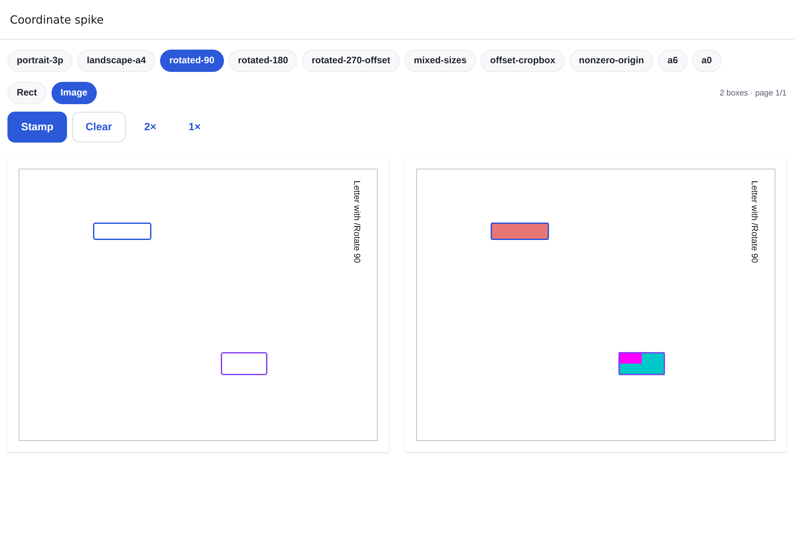
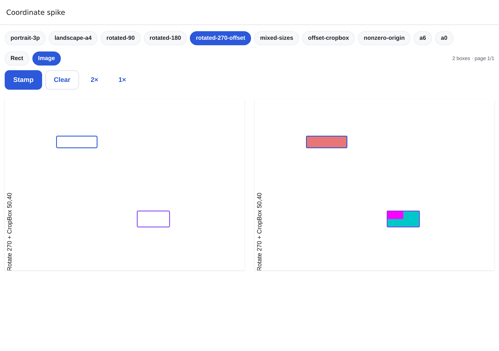
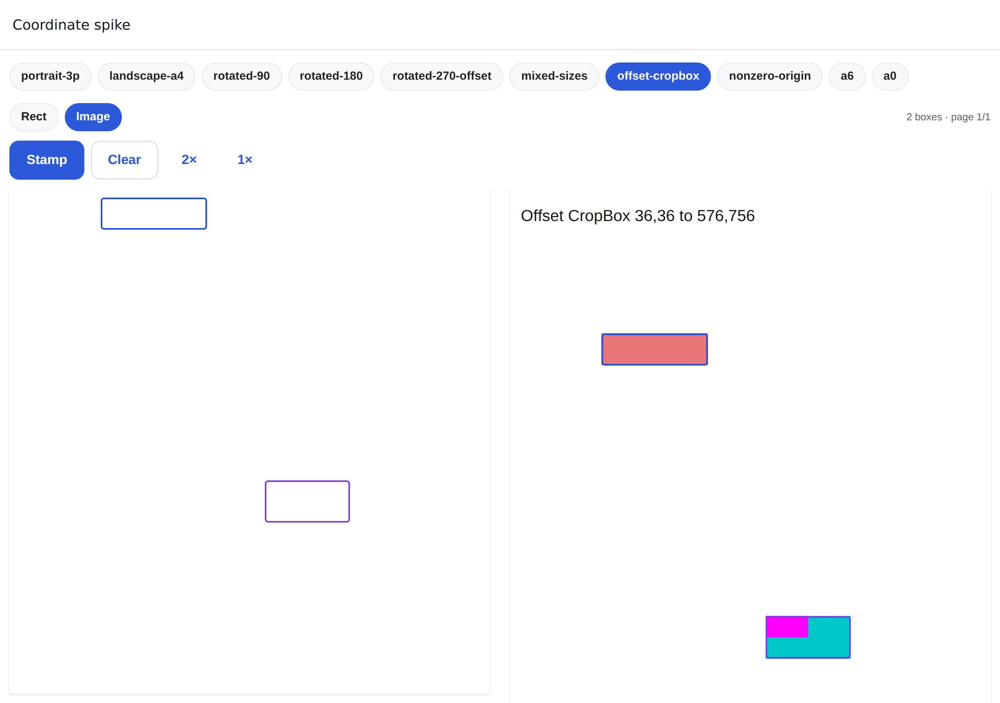

# Phase 3 spike report (STOP 2)

Covers Phase 3 §A–§C: the PDF surface, the geometry module, the flattening primitive and the coordinate
spike. §D–§G (signatures, Account → Signatures, viewer screens, security/docs) have not started yet.

**Recommendation: GO, on one condition.** Every check that can run here (web, Node/Deno, Chromium)
passes. Before §D starts, the device round trip (below) needs to pass on an iOS simulator and an Android
emulator; it has not been run because this environment has no simulator.

## Renderer decision

**pdf.js 6.3.289 (legacy build) in a single offline HTML file**, loaded by `react-native-webview` on
iOS/Android and by a sandboxed iframe on web. The app sends the surface a short-lived signed URL, and
the surface fetches the PDF itself with range requests, so no base64 crosses the bridge and nothing is
written to disk.

| Requirement                      | Result                                                                                                                                                                                                                               |
| -------------------------------- | ------------------------------------------------------------------------------------------------------------------------------------------------------------------------------------------------------------------------------------ |
| Offline, no CDN                  | One 2.2 MB file (`assets/pdf-surface/surface.html`), with the pdf.js core and worker inlined. CSP `default-src 'none'` allows network access only to fetch the PDF. A Jest test fails if the file is stale or loads anything remote. |
| Worker                           | Classic Blob worker. Module workers **fail in opaque origins** (sandboxed iframe, and `file://` pages in WebViews), which this spike found and fixed. If no worker can start, pdf.js runs on the main thread (tested).               |
| Virtualization and memory budget | Only visible pages ±1 have canvases; others are released. Canvas pixels are capped at min(16.7 MP, 3 × screen² × dpr²).                                                                                                              |
| Zoom                             | Pinch from fit-width to 4× (CSS transform during the gesture, re-render on release), double-tap 1×/2×, and `setZoom` from the app.                                                                                                   |
| Geometry                         | `loaded` reports each page's visible box (CropBox ∩ MediaBox), offset and `/Rotate`, matching SPEC §8.1.                                                                                                                             |
| Errors                           | `PDF_RENDER_FAILED` / `NETWORK_OFFLINE`, plus a 30 s open timeout. Retry is a new `load`; a crashed WebView content process remounts and replays its state.                                                                          |
| CORS                             | Storage allows `Origin: null` and Range requests, which is what a `file://` page and a sandboxed iframe send. The web round trip below confirms it against local Storage.                                                            |

The fallbacks (`react-native-pdf` with native overlays, or server-rasterized pages) were not evaluated,
because nothing here argues for them. If the device round trip fails, they are the next step.

## Golden test 1: math vs pdf.js (`supabase/functions/tests/geometry.golden.test.ts`)

Covers 10 fixtures: portrait Letter ×3, landscape A4, `/Rotate` 90, 180 and 270 combined with an offset
CropBox, mixed sizes, offset CropBox, non-zero MediaBox origin, A6 and A0. For each page, a 7×7 grid of
points is mapped through `viewport.convertToPdfPoint` and through `shared/geometry.ts`, and the inverse
is checked too. **Worst deviation: 0 pt** (tolerance ±1 pt). There are also 9 unit and property tests
(fast-check round trips within 1e-6).

## Golden test 2: raster (`npm run test:golden`)

Rects and an asymmetric image marker are stamped with `stamp.ts`, then rendered by the real surface in
Chromium at 3× scale, and the coloured regions are measured. The test covers 20 PDFs, 300 edges, every
fixture page and both `stampRect` and `stampImage`. **Worst deviation: 0.665 pt.** A mutation check that
draws 90° images as 270° fails the test (off by 91.7 pt), so the test does catch a rotated or mirrored
image.

## Round trip on web (`node tests/surface/web-roundtrip.mjs`)

This drives the real app (a dev web build) in Chromium: sign in, open `/dev/coordinate-spike`, tap boxes
on every page of 8 fixtures (rects tapped at 1×, images at 2× zoom), press **Stamp**, which calls
`dev-stamp` and then `stamp.ts`, and measure the stamped PDF in the right-hand pane.

- **26 stamps, all pass.** The worst centre deviation is 0.34 pt on every page except A0.
- **A0:** 0.58 pt for the rect and 1.29 pt for the image. On A0, one rendered pixel is about 1.9 pt in
  this pane, so the A0 check uses a tolerance of one pixel. This is a limit of the measurement, not of
  the mapping: golden test 1 is exact on A0.
- Every image stamp is upright: the magenta quadrant sits at the top-left.

Left pane: the boxes as tapped (outlines). Right pane: the stamped PDF from `dev-stamp`, with the same
outlines drawn on top. A stamp that missed would show red or cyan outside its outline.

| `/Rotate 90`                               | `/Rotate 270` + CropBox at 50,40                           | Offset CropBox                                     |
| ------------------------------------------ | ---------------------------------------------------------- | -------------------------------------------------- |
|  |  |  |

## Performance (200 pages, 22 MB, one image per page; Chromium with CPU throttling, not devices)

| Metric                              | iPhone-sized 390×844 @3x | Low-end Android 360×780 @2x, CPU ÷4 |
| ----------------------------------- | ------------------------ | ----------------------------------- |
| `loaded` (all page sizes known)     | 320 ms                   | 1066 ms                             |
| First page rendered                 | 345 ms                   | 1279 ms                             |
| Scroll through all 200 pages        | 8.6 s (43 ms/page)       | 28.8 s (144 ms/page)                |
| Most canvases alive at once         | 6                        | 6                                   |
| Most canvas memory at once          | 36 MB                    | 13 MB                               |
| Canvases / JS heap after the scroll | 4 / 6 MB                 | 4 / 7 MB                            |
| Re-render after zooming to 2×       | 152 ms                   | 301 ms                              |

Memory stays flat no matter how many pages are scrolled. Scroll smoothness can only be judged on a
real device.

## Your device round trip (needed before GO is final)

1. Start the stack: `npm run db:start`. Then `cp supabase/functions/.env.example supabase/functions/.env`
   and `npm run functions:serve`.
2. Run a development build (`npx eas-cli@latest build --profile development`, or `npm run ios` /
   `npm run android`) with `EXPO_PUBLIC_SUPABASE_URL` set to your LAN IP. Then run `npm start`.
3. Sign in as `owner@signflow.test`, open `signflow://dev/coordinate-spike` (or go to `/dev/coordinate-spike`),
   then for `rotated-270-offset`, `rotated-90` and `offset-cropbox`: tap a few boxes (pinch-zoom for
   some of them), press **Stamp**, and check that the fills sit inside the outlines and the magenta
   marker is at the top-left.
4. Optionally, scroll a large PDF and judge smoothness. Every document in the seed is small.

What I'd watch for on devices: the WebView loading the `file://` asset (`allowingReadAccessToURL` on
iOS; `allowFileAccess` on Android), `incognito` combined with `file://` on iOS, and cleartext `http` to
the local Supabase on Android (allowed in debug builds).

## Known limitations

- **No device or simulator testing** (above). Native wiring is covered by component tests with a
  mocked WebView: lockdown props, navigation allow-list, message validation and state replay.
- **Fonts:** CJK cMaps and standard font data are not bundled, so PDFs that rely on non-embedded fonts
  render with system fonts, and some CJK text may not render. The optional wasm image decoders
  (JPEG 2000, ICC) are not bundled, so JPX images fall back to pdf.js's JS path or do not render.
  Bundling them adds about 1.5 MB. Tell me if that is wanted.
- **No offline viewing:** signed URLs are fetched live and nothing is cached on disk, by design.
- `/dev/*` routes stay in Expo Router's route list in production, but render a redirect, are hidden by
  `Stack.Protected guard={__DEV__}`, and their screen code is stripped (`npm run check:dev-routes`
  exports web and Android production bundles and checks this; a mutation test confirmed it catches a
  regression).

## What was built

- `shared/geometry.ts` and `shared/pdfBridge.ts` (versioned, Zod on both ends).
- `web/pdf-surface/*` and `scripts/build-surface.mjs`, producing `assets/pdf-surface/surface.html`;
  `metro.config.js` registers `html` as an asset extension.
- `src/features/viewer/`: `PdfSurface` (native WebView / web iframe), `SurfaceSession` (queues commands
  until `ready` and replays state after a restart), `useSurface`.
- `supabase/functions/_shared/pdf/stamp.ts`, plus the dev-only `dev-stamp` function: it requires
  `DEV_TOOLS=true`, its fixtures are embedded, and it is excluded from `npm run functions:deploy`.
- `/dev/coordinate-spike`, plus the new fixtures (rotation 180, 270 + offset, A6, A0).
- Tests:
  - Jest: 220 (bridge, session, PdfSurface, surface freshness, geometry).
  - Deno: 36 (golden test 1, dev-stamp gate and deploy list).
  - pgTAP: 94.
  - Playwright: surface behaviour (5), golden raster (20), web round trip (26 stamps), performance.

`process-upload` already extracted the SPEC §8.1 visible box with `box_x_pt`/`box_y_pt` in Phase 2, and
golden test 1 confirms it matches pdf.js, so no migration or backfill was needed.
