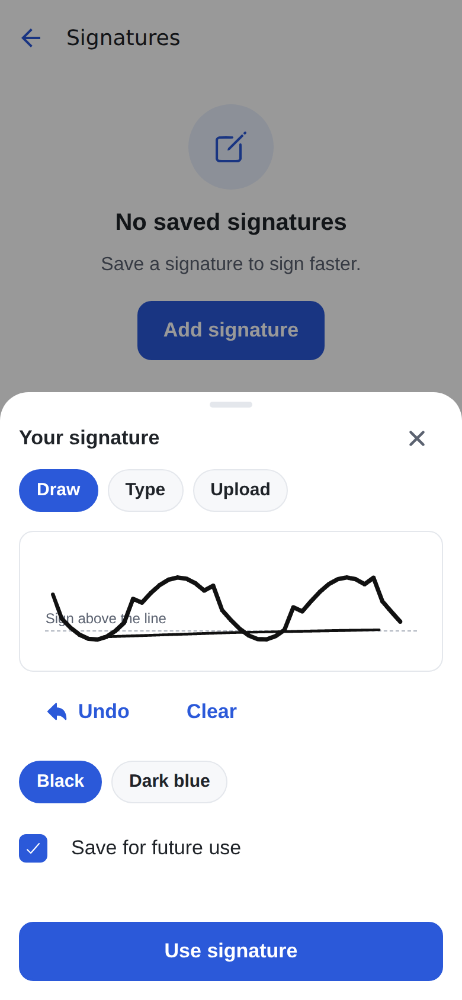
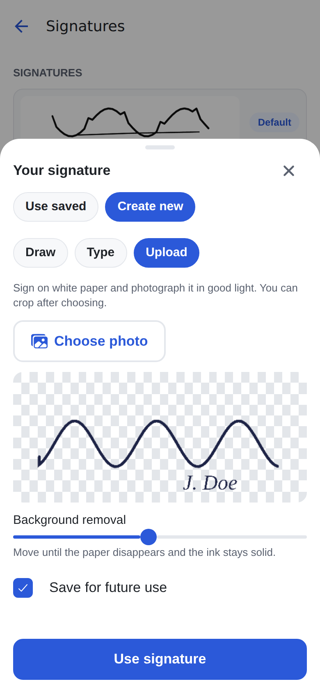
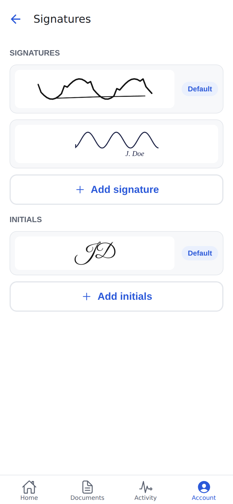
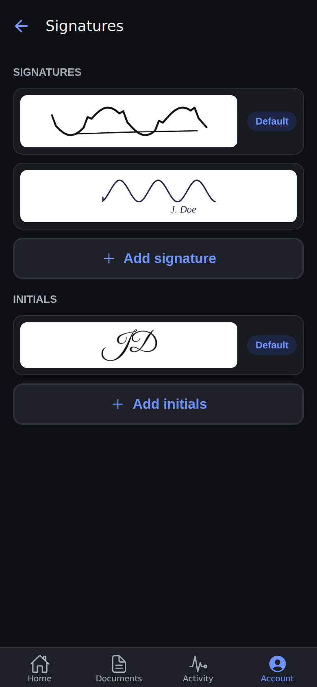
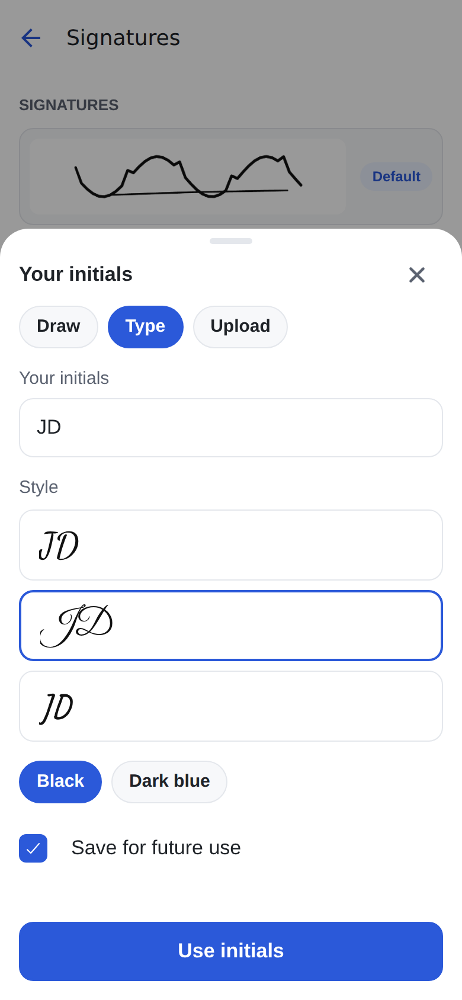
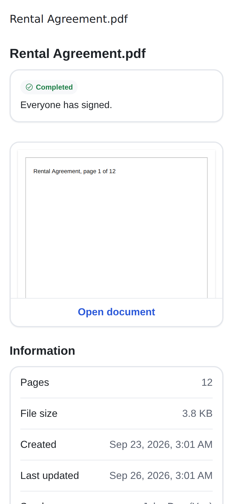
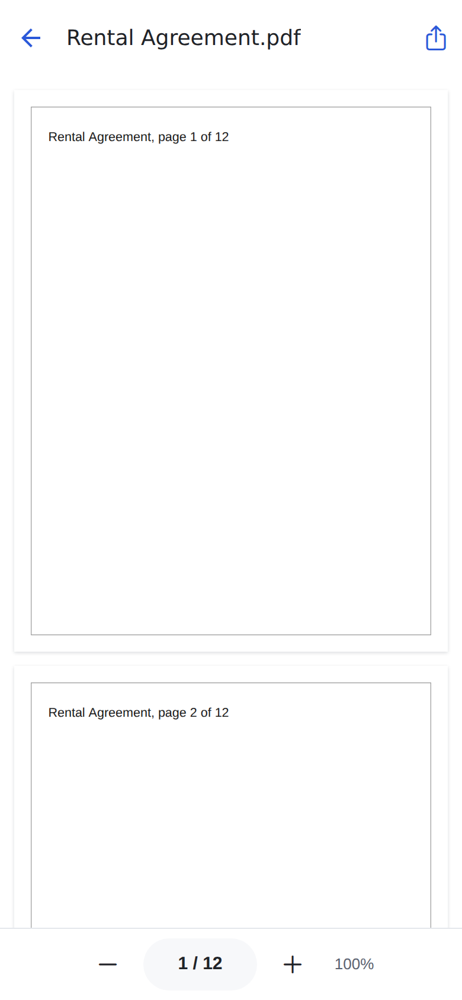
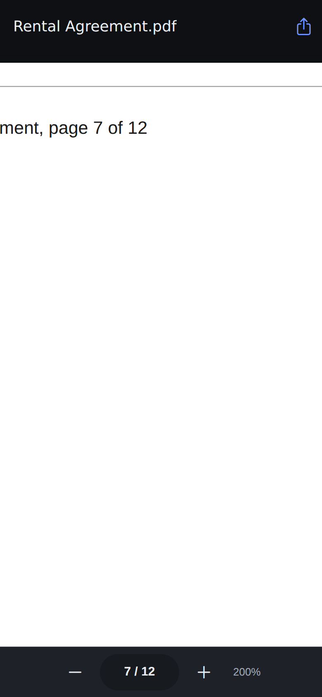

# Phase 3 report: PDF viewer & signature creation

## 1. Summary

- **Renderer.** All documents render through one offline pdf.js surface. It runs in a locked-down
  `react-native-webview` on iOS/Android and in a sandboxed iframe on web. A versioned, Zod-validated
  bridge connects it to the app.
  - Pages are virtualized under a canvas pixel budget.
  - Zoom works by pinch, double tap or buttons, from fit-width to 4×.
  - Overlays are drawn inside the surface, positioned in page fractions.
- **Geometry and flattening.**
  - `shared/geometry.ts` maps between displayed fractions and PDF user space. It handles rotation and
    offset boxes.
  - `supabase/functions/_shared/pdf/stamp.ts` holds `stampRect` and `stampImage`, which Phase 6 will
    reuse.
  - Both golden tests pass, and so does the round trip through the real app on web.
- **Signatures.**
  - `SignatureSheet` creates or picks a signature or initials, with three tabs:
    - **Draw:** Skia canvas on light paper, variable-width strokes, undo/clear, ink colour.
    - **Type:** three bundled OFL fonts.
    - **Upload:** pick or shoot a photo, crop, then remove the background with a threshold slider and a
      checkerboard preview.
  - Every method outputs a trimmed, transparent PNG of 600–1200 px, at most 500 KB.
  - "Save for future use" stores the PNG and a `saved_signatures` row.
  - Account → Signatures lists saved items and supports add, set default and delete.
- **Viewer.**
  - `documents/[id]/view` has a page indicator, a page-jump sheet, zoom buttons and Share.
  - Document details shows a first-page preview card that opens the viewer.
  - `get-download-url` takes `purpose: 'view' | 'download'`. A view logs `DOCUMENT_VIEWED` at most once
    per user and document per 30 minutes.
- **Security and cleanup.**
  - The WebView can only load the bundled asset.
  - Signature images are never logged.
  - Unsaved signatures stay in the app cache and are deleted at sign-out and on account switch.
  - `dev-stamp` and `/dev/*` are absent from production, and a build check proves it.

## 2. Spike report (final)

- The full STOP 2 report is in [`phase-3-spike.md`](./phase-3-spike.md).
- **Decision at STOP 2: GO with pdf.js in a WebView.** You approved continuing to §D–§G.
- **Still open: the device round trip on an iOS simulator and an Android emulator.** No results have
  been reported back yet, and this environment has no simulator. The `/dev/coordinate-spike` screen and
  the steps are ready (spike report, "Your device round trip").

Results since STOP 2:

| Check                                                               | Result                                                                             |
| ------------------------------------------------------------------- | ---------------------------------------------------------------------------------- |
| Golden test 1: `geometry.ts` vs pdf.js, 10 fixtures × 7×7 points    | worst deviation **0 pt**                                                           |
| Golden test 2: stamped rects and images rendered by the surface     | 20 PDFs, 300 edges, worst **0.665 pt**; the mutation check catches a 90°/270° swap |
| Web round trip through the real app (8 fixtures, taps at 1× and 2×) | **26/26** stamps; worst 0.34 pt, A0 1.29 pt (one rendered pixel ≈ 1.94 pt)         |
| Image orientation on rotated pages                                  | all upright (asymmetric marker)                                                    |

Follow-ups found and fixed after STOP 2:

- **Signed URL expiry.** The surface now fetches the rest of the file in the background after the first
  page, so a 5-minute signed URL cannot expire halfway through a long read.
- **Theme change reloaded the document.** Switching light/dark sent a new `load`, which reset zoom and
  page. A new `setBackground` command recolours without reloading. Both a test and a browser check cover
  it.
- **Web screen readers did not hear checked/selected state.** React Native Web does not expose
  `accessibilityState`, which affected the shared Checkbox and ChipGroup (from Phase 1) and all new
  radios. They now use `aria-checked`, `aria-selected` and `aria-disabled`.

Web screenshots:

| Spike: `/Rotate 270` + offset CropBox    | Signature sheet: draw                     | Upload with background removal                       |
| ---------------------------------------- | ----------------------------------------- | ---------------------------------------------------- |
|  |            |                     |
| **Account → Signatures**                 | **Dark mode**                             | **Typed initials**                                   |
|      |  |              |
| **Details: first-page preview**          | **Viewer**                                | **Viewer, dark, 200%, page 7, after a theme switch** |
|      |                |                      |

More screenshots are in [`phase-3/`](./phase-3): the empty state, the saved picker, the page-jump sheet,
and the rotated-90 and offset-CropBox spike pages.

## 3. File tree (created `+` / changed `~`)

```
app/
  ~ _layout.tsx                       portrait lock at launch, /dev/coordinate-spike screen
  ~ (app)/_layout.tsx                 viewer route
  + (app)/documents/[id]/view.tsx
  ~ (app)/(tabs)/account/_layout.tsx
  + (app)/(tabs)/account/signatures.tsx
  ~ dev/components.tsx                stripped from production bundles
  + dev/coordinate-spike.tsx
assets/
  + pdf-surface/surface.html          GENERATED by npm run build:surface
  + fonts/{DancingScript-SemiBold,GreatVibes-Regular,Caveat-Medium}.ttf, OFL-*.txt, README.md
shared/
  + geometry.ts, pdfBridge.ts, __tests__/{geometry,pdfBridge}.test.ts
  ~ errors.ts                         SIGNATURE_LIMIT, SIGNATURE_TOO_SIMPLE
web/pdf-surface/                      + src/main.ts, src/transport.ts, template.html
src/
  features/viewer/                    + PdfSurface(.web).tsx, surfaceSession.ts, useSurface.ts, ViewerScreen.tsx,
                                        types.ts, surfaceAsset.ts, index.ts, __tests__/ (4 files)
  features/signatures/                + SignatureSheet, DrawPane, DrawPad, TypePane, UploadPane, SignatureImage,
                                        SignaturesScreen, pixels.ts, render.ts, produce.ts, loadProducers.ts,
                                        localFiles(.web).ts, fonts.ts, ink.ts, api.ts, hooks.ts, types.ts,
                                        index.ts, __tests__/ (4 files)
  features/documents/                 + DocumentPreviewCard.tsx; ~ DocumentDetailsScreen, api, hooks, test
  features/dev/                       + CoordinateSpikeScreen.tsx
  features/auth/                      + localData.ts; ~ AuthProvider (+ test)
  features/account/                   ~ AccountScreen (+ test)
  features/upload/                    ~ storageUpload.ts (signatures bucket)
  components/                         ~ AppButton, AppInput, Checkbox, ChipGroup, ListRow, LoadingSkeleton,
                                        ProgressBar (aria-* state)
  hooks/                              + useOrientation.ts
  lib/                                + skia.ts, skia.web.ts; ~ errors.ts (+ test), queryKeys.ts
  theme/                              ~ tokens.ts (paper, paperLine, paperText)
  types/                              + assets.d.ts; ~ database.ts (regenerated)
  i18n/en.json                        ~ viewer, signatures, account, errors
supabase/
  + migrations/20261004000100_saved_signatures.sql
  + migrations/20261004000200_view_events.sql
  + tests/database/06_saved_signatures.test.sql
  + functions/_shared/pdf/stamp.ts;  ~ _shared/{deps,events}.ts, _shared/test/fixtures.ts
  + functions/dev-stamp/{index,logic,fixtures}.ts      (dev only, not deployed)
  ~ functions/get-download-url/logic.ts                (purpose)
  + functions/tests/{geometry.golden,dev-stamp}.test.ts; ~ get-download-url.test.ts
  + functions/.env.example
tests/surface/                        + harness.mjs, surface.test.mjs, golden.test.mjs, performance.mjs, web-roundtrip.mjs
scripts/                              + build-surface.mjs, check-dev-routes.mjs, golden/{generate-stamped,generate-perf}.ts
                                      ~ generate-fixtures.ts (new fixtures; dev-stamp fixtures)
fixtures/pdf/                         + rotated-180, rotated-270-offset, a6, a0
jest/                                 + skiaEnvironment.js (real CanvasKit in Jest)
+ metro.config.js (html assets)       ~ jest.setup.ts (gesture handler), app.config.ts (orientation)
~ package.json, README.md, SPEC.md, .env.example, .gitignore
```

## 4. Migrations

| Migration                         | Purpose                                                                                                                                                                                                                                                                                                                                                                                                                                                                                                                        |
| --------------------------------- | ------------------------------------------------------------------------------------------------------------------------------------------------------------------------------------------------------------------------------------------------------------------------------------------------------------------------------------------------------------------------------------------------------------------------------------------------------------------------------------------------------------------------------ |
| `20261004000100_saved_signatures` | Adds the `signature_kind` and `signature_method` enums and the `saved_signatures` table: path check `{user}/{id}.png`, typed text and font required exactly when typed, RLS self-only, insert/delete only. The first item of a kind becomes the default; there is one default per kind (partial unique index); `set_default_signature()` swaps it atomically; deleting the default promotes the newest; the 6th of a kind raises `SF001`. Also creates the private `signatures` bucket (PNG, ≤ 1 MB) with owner-only policies. |
| `20261004000200_view_events`      | `log_document_view()` (service role only) writes `DOCUMENT_VIEWED` at most once per user per document per 30 minutes. It holds an advisory lock so concurrent opens cannot double-log, and is backed by a partial index.                                                                                                                                                                                                                                                                                                       |

**No `document_pages` change or backfill was needed.** Phase 2 already stored the SPEC §8.1 visible
box and its origin. Golden test 1 confirms that `inspectPdf` matches pdf.js on every fixture page,
including offset CropBox, non-zero MediaBox origin and `/Rotate 270` + CropBox. Every seed document is
an unrotated Letter page at origin 0,0.

## 5. Bridge protocol (for Phase 4)

`shared/pdfBridge.ts`, `BRIDGE_VERSION = 1`.

- **Format.** Every message is a JSON string with `v: 1`. Both ends validate with Zod and drop anything
  invalid, including wrong versions, non-strings and messages over 4 MB.
- **Transport.** Native uses `WebView.postMessage` and `window.ReactNativeWebView.postMessage`. Web uses
  `postMessage` between the app and the sandboxed iframe; the app accepts messages only from that
  iframe's window.
- **Startup and restarts.** Commands are queued until the surface sends `ready`. The latest `load`,
  `setBackground`, `setOverlays` and `highlight` are replayed whenever the surface restarts (for example
  after a WebView content-process crash).

| Commands (app → surface)                                          | Events (surface → app)                                                                                                              |
| ----------------------------------------------------------------- | ----------------------------------------------------------------------------------------------------------------------------------- |
| `load { url, background, pageLabel, interactive? }`: http(s) only | `ready`                                                                                                                             |
| `setBackground { background }`                                    | `loaded { pageCount, pages: [{ page, width_pt, height_pt, box_x_pt, box_y_pt, rotation }] }`: SPEC §8.1 visible box, displayed size |
| `goToPage { page }`                                               | `pageChanged { page, pageCount }`                                                                                                   |
| `setZoom { zoom }`: 1–4 (1 = fit width)                           | `zoomChanged { zoom }`                                                                                                              |
| `setOverlays { overlays ≤ 500 }`                                  | `tap { page, x, y }`: displayed fractions, top-left origin, at any zoom                                                             |
| `highlight { id \| null }`                                        | `error { code: PDF_RENDER_FAILED \| NETWORK_OFFLINE, message }`                                                                     |

- **Overlay fields.** `{ id, page, rect: {x, y, width, height} in fractions, kind: 'rect' | 'image',
color?, fill?, src? (PNG data URL ≤ 3 MB), label? }`.
- **What Phase 4 adds.** Drag and resize events, such as `overlayChanged`, as new message types under
  `v: 1`; they are additive. Bump the version only for breaking changes.
- **Coordinates.** Convert fractions to PDF points with `shared/geometry.ts` (`fractionRectToPdfRect`)
  and the page entry from `loaded`.

## 6. Test results

| Command                                         | Result                                                                                     |
| ----------------------------------------------- | ------------------------------------------------------------------------------------------ |
| `npx tsc --noEmit`                              | clean                                                                                      |
| `npx expo lint`                                 | clean                                                                                      |
| `npx prettier --check` (src, shared, app, docs) | clean                                                                                      |
| `npm test` (Jest)                               | **272 passed**, 30 suites                                                                  |
| `npm run db:reset` then `npm run db:test`       | reset from scratch OK; **121 pgTAP** assertions, 6 files, PASS                             |
| `npm run test:functions` (Deno)                 | **40 passed** (incl. golden test 1, dev-stamp gate, view de-duplication)                   |
| `npm run test:integration`                      | **16 passed**                                                                              |
| `npm run test:surface` (Playwright)             | **6 passed** (worker + main-thread fallback, errors, invalid commands, taps, preview mode) |
| `npm run test:golden`                           | **20 passed**, 300 edges, worst 0.665 pt                                                   |
| `node tests/surface/web-roundtrip.mjs`          | **26/26** stamps                                                                           |
| `npm run check:surface`                         | `surface.html` is up to date                                                               |
| `npm run check:dev-routes`                      | web and Android production bundles contain no dev screens                                  |

Signature rendering is tested against **real Skia** (CanvasKit in Jest):

- trim, padding and size limits;
- ink colour kept;
- no holes in variable-width strokes, with a mutation check;
- all three fonts render;
- a noisy-upload worst case stays under 500 KB.

## 7. Performance

The fixture is 200 pages, 22 MB, with one distinct image per page. These numbers come from **Chromium
with CPU throttling**, using the same surface bundle. They are not device numbers: iOS and Android
measurements need your dev builds (next step in §11).

| Metric                               | iPhone-sized 390×844 @3x | Low-end Android 360×780 @2x, CPU ÷4 |
| ------------------------------------ | ------------------------ | ----------------------------------- |
| First page rendered                  | 470 ms                   | 1.42 s                              |
| Scroll through all 200 pages         | 9.2 s (46 ms/page)       | 30.9 s (155 ms/page)                |
| Most canvases alive at once          | 6                        | 6                                   |
| Most canvas memory at once           | 36 MB                    | 13 MB                               |
| Main-thread JS heap after the scroll | 5 MB                     | 6 MB                                |
| Re-render after zooming to 2×        | 148 ms                   | 288 ms                              |

- These figures include background fetching (first page about 0.1 s slower than at STOP 2, in exchange
  for robustness against the 5-minute URL).
- The file bytes live in the pdf.js worker, roughly the file size, and are not included in the heap
  figure.

## 8. Acceptance criteria

| #   | Criterion                                                                                                      | Status | Evidence                                                                                                                                                                                            |
| --- | -------------------------------------------------------------------------------------------------------------- | ------ | --------------------------------------------------------------------------------------------------------------------------------------------------------------------------------------------------- |
| 1   | typecheck, lint, Jest, pgTAP, Deno pass; `db reset` from scratch                                               | ✅     | §6                                                                                                                                                                                                  |
| 2   | Golden tests 1 and 2 on every fixture page, ±1 pt; upright, not mirrored                                       | ✅     | 0 pt / 0.665 pt; marker test plus mutation check                                                                                                                                                    |
| 3   | Device round trip on iOS, Android and web, with screenshots                                                    | ⚠️     | **Web ✅** (26/26, screenshots). **iOS/Android not run:** no simulator here; the route and steps are ready                                                                                          |
| 4   | `document_pages` uses the §8.1 visible box (backfill run and verified)                                         | ✅     | Already correct since Phase 2; golden test 1 verifies `inspectPdf` against pdf.js; no backfill required                                                                                             |
| 5   | 200-page fixture: first page within budget, scrolls without crashing, bounded memory on emulator and simulator | ⚠️     | Chromium numbers (§7): bounded at 6 canvases. Device runs pending                                                                                                                                   |
| 6   | Draw, type and upload both kinds; trimmed transparent PNG within limits; save, default, delete                 | ✅     | Real-Skia tests; web run created a drawn, a typed and an uploaded item (17–44 KB PNGs), defaults and delete. Native Draw gestures untested on device                                                |
| 7   | pgTAP: isolation, one default, 6th rejected                                                                    | ✅     | `06_saved_signatures.test.sql` (27 assertions)                                                                                                                                                      |
| 8   | `DOCUMENT_VIEWED` ≤ 1 per 30 min, recipient status unchanged, download still logged                            | ✅     | Deno tests (incl. concurrency); web run: preview plus viewer produced exactly 1 event                                                                                                               |
| 9   | PDF cache cleared on logout; WebView navigation blocked                                                        | ✅     | The viewer keeps **no PDF cache** (streams), so there is nothing to clear; signature files are cleared at sign-out and account switch (test). Navigation allow-list tested in `PdfSurface.test.tsx` |
| 10  | `dev-stamp` refuses without `DEV_TOOLS`; `/dev/*` absent from production                                       | ✅     | Deno test; `check:dev-routes` with a mutation check                                                                                                                                                 |
| 11  | Light/dark, largest font, screen-reader labels; Type tab usable with a screen reader                           | ⚠️     | Light/dark ✅ (screenshots); labels and roles ✅ (tests query by accessible name; aria fix for web). **Largest font size and real VoiceOver/TalkBack not verified** (no device)                     |
| 12  | README: surface build, fonts and licences, `DEV_TOOLS`, golden tests; `.env.example`                           | ✅     | README sections "PDF surface", "Fonts and licences", "Skia on web", dev routes, scripts                                                                                                             |

## 9. Stubs & TODOs

- **Stretch goal: pdf.js text layer for screen readers. Not done.** Pages are announced "Page n of N",
  and the screen-reader path to the content is Share → another app. Target: Phase 6 or 8.
- **Page jump** uses a grid of page numbers rather than thumbnails (the prompt allows either).
  Thumbnails: LATER.
- **Device checks:** round trip, 200-page performance, landscape drawing on phones, largest font,
  VoiceOver/TalkBack. Needs your dev builds.
- **Orphaned signature images.** If the storage delete fails after the row is deleted, the image stays
  behind (private, harmless). Sweep with `cron-tick`: Phase 7.
- **Not bundled in the surface:** CJK cMaps, standard-font data and the optional JPEG 2000 and colour
  profile decoders (about 1.5 MB). Text in non-embedded CJK fonts may not render. Decide before Phase 6.
- **Tooling quirk:** a static `expo export --dev` web build reloads when it loads lazy Skia chunks.
  `expo start --web` and production exports work (README note).
- **Applying a signature** to a document (copying the PNG into the document folder): Phase 6, using
  `stampImage` and `SignatureResult`.
- **Still labelled in Account:** security rows "Coming in Phase 8" (unchanged).

## 10. Spec issues

1. **PDF cache (prompt §F) vs streaming.** The viewer streams the signed URL, so there is no local PDF
   cache and nothing to clear at logout. SPEC §2, §5.4 and §16 are updated to say so. If offline viewing
   is ever wanted, it needs the cache design from the prompt.
2. **The 600–1200 px long edge can conflict with ≤ 500 KB** for very noisy uploads. The size cap wins:
   the image is scaled below 600 px if needed. Proposal: keep "size cap wins" (now in SPEC §5.7).
3. **The details preview counts as a view.** It renders page 1, so it calls `purpose: 'view'` and logs
   `DOCUMENT_VIEWED` (de-duplicated with the viewer). Please confirm this is the audit behaviour you want.
4. **`accessibilityState` is invisible on React Native Web.** SPEC §16 now requires `aria-*` state props,
   which the guest signing page in Phase 6 depends on.
5. **Orientation.** The native config now allows all orientations so the Draw tab can rotate. The app
   locks to portrait at launch and unlocks only while drawing. iPad therefore stays portrait as before.
   Should tablets rotate everywhere?
6. **Signed URL TTL (5 min) and long sessions.** This is solved in the viewer by background fetching.
   Phase 6 guest flows should reuse the same surface rather than fetch ranges lazily.

## 11. Next: what Phase 4 needs from you

1. **The device round trip and performance on iOS and Android dev builds.** Steps are in the spike
   report; the 200-page file comes from `npx deno run --node-modules-dir=none -A scripts/golden/generate-perf.ts` (written to `.golden/heavy-200.pdf`). Send screenshots
   or numbers and I will add them here.
2. **Answers to §10:** item 3 (preview logs a view), item 5 (tablet orientation), and whether to bundle
   CJK and JPEG 2000 support (§9).
3. **Phase 4 prompt.** The overlay layer is ready for drag and resize. Field placement will go in
   `document_fields` using fractional rects and `shared/geometry.ts`.
