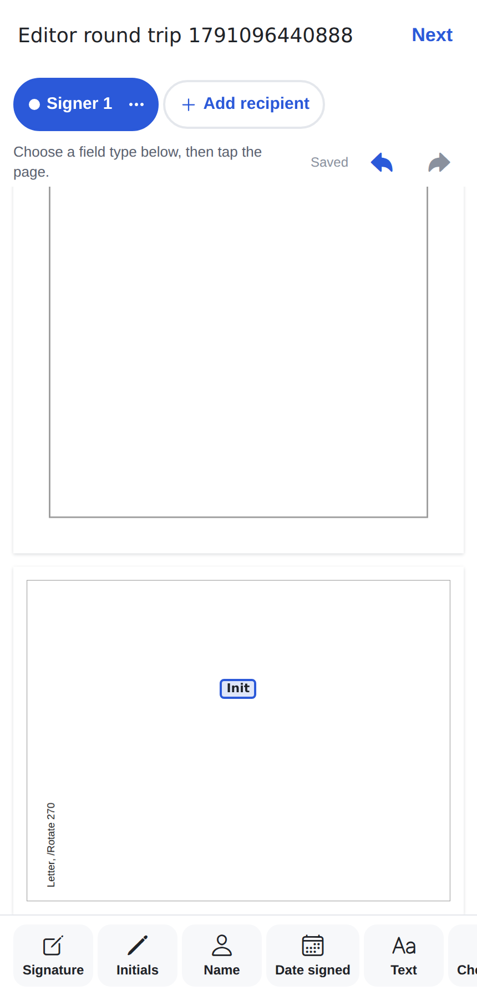

# Phase 4 report: field editor

## 1. Summary

The editor lives at `documents/[id]/fields`. It is reached from the wizard (after Details, before the
Phase 5 recipient step) and from a draft's details screen ("Place fields").

- **Placing fields.** Tap a field type, then tap the page. The field appears at a default size,
  centred on the tap and snapped inside the page. A "Place in the middle of page n" button is the
  accessible alternative to tapping.
- **Moving and resizing.** Drag a field to move it; drag a corner handle to resize it. This happens
  inside the PDF surface, so fields scroll and zoom with the page. Fields snap to the page bounds and
  respect a minimum size per type. The properties sheet also has move and resize buttons.
- **Field types.** The toolbar shows MUST types first (Signature, Initials, Name, Date signed, Text,
  Checkbox), then SHOULD types (Email, Radio, Dropdown). Stamp is LATER and not offered.
- **Recipients.** A chip row picks who new fields are for. There are 8 colours, checked for contrast in
  light and dark mode. Recipients can be added, renamed and removed. Placeholder recipients without an
  email are allowed in drafts: a draft with no recipients starts with "Signer 1".
- **Properties sheet.** Recipient, required, font size, alignment, placeholder, default value,
  validation (none / email / number / regular expression), date format, dropdown options, radio group
  and value, and checked by default.
- **Editing.** Undo and redo (50 steps), duplicate, delete.
- **Autosave.** 800 ms after the last change, with a status label. The status reads "Saving…" while
  anything is unsaved. Next saves first. On web, closing or reloading the tab with unsaved changes
  asks for confirmation.
- **Locked after sending.** Once a document is sent the editor is read-only, and the database refuses
  changes.

## 2. Decisions (no stop point was taken; you asked me to continue through the phases)

1. **Placeholder recipients.** `document_recipients.email` is now nullable. `send-document`
   (Phase 5) must refuse while any recipient has no email. The alternative, fake
   `@placeholder.invalid` emails, would leak into search and the linking logic.
2. **Autosave replaces the whole field set.** `save_document_fields(document, fields[])` runs as the
   caller, so RLS applies, and replaces the set in one transaction. That is simpler and safer than
   per-field calls for a set capped at 500 fields. Unchanged rows are not rewritten.
3. **Recipient colour = position** in the recipient list (signing order, then creation). The colour is
   not stored.
4. **Recipient visibility of fields.** An active participant sees only their own fields. Seeing other
   people's filled fields arrives with `field_values` in Phase 6.
5. **"Next" goes to document details** until Phase 5 adds the Review & send step.
6. **Phase 3 open questions, kept as defaults:**
   - opening the details preview logs a view (de-duplicated);
   - tablets stay in portrait;
   - CJK fonts and JPEG 2000 images are not bundled.

## 3. Files

```
supabase/migrations/20261005000100_document_fields.sql   field_type enum, document_fields, RLS, save RPC, nullable email
supabase/tests/database/07_document_fields.test.sql      19 assertions
shared/fields.ts (+ test)                                field types, sizes, per-type properties (Zod), defaults
shared/geometry.ts (+ tests)                             moveFractionRect, resizeFractionRect, rectAround
shared/pdfBridge.ts                                      overlay editable/text/minWidth/minHeight; overlayTap, overlayChanged
web/pdf-surface/src/main.ts, template.html               drag/resize with pointer capture, handles, labels
src/features/viewer/{types,useSurface}.ts                onOverlayTap / onOverlayChanged
src/features/editor/                                     state.ts (reducer), api.ts, useAutosave.ts, fieldMeta.ts,
                                                         FieldEditorScreen, FieldToolbar, RecipientChips,
                                                         RecipientSheet, FieldPropertiesSheet, __tests__/ (2)
app/(app)/documents/[id]/fields.tsx, app/(app)/_layout.tsx
src/features/documents/DocumentDetailsScreen.tsx         "Place fields" for drafts
src/features/upload/screens/RecipientsPlaceholderScreen  "Next: place fields"
src/theme/tokens.ts (+ contrast test)                    recipientColors
tests/surface/surface.test.mjs                           editable overlay test
tests/e2e/editor-roundtrip.mjs                           Phase 4 "done when" check in the real web app
```

## 4. Bridge additions (v1, additive)

| Message                                   | Change                                                                                               |
| ----------------------------------------- | ---------------------------------------------------------------------------------------------------- |
| Overlay                                   | New optional `editable`, `text` (short label inside the box), `minWidth` and `minHeight` (fractions) |
| Command `highlight { id }`                | Now also shows the resize handles on an editable overlay                                             |
| Event `overlayTap { id }`                 | An editable overlay was tapped (without moving)                                                      |
| Event `overlayChanged { id, page, rect }` | Sent when a drag or resize ends; `rect` is already clamped and at least the minimum size             |

## 5. Test results

| Check                                 | Result                                                                                                                                                                                                 |
| ------------------------------------- | ------------------------------------------------------------------------------------------------------------------------------------------------------------------------------------------------------ |
| `tsc`, `expo lint`                    | clean                                                                                                                                                                                                  |
| Jest                                  | **302 passed** (33 suites), incl. reducer, editor screen (8), field schemas, recipient colour contrast                                                                                                 |
| pgTAP                                 | **140 passed** (7 files) after `db reset`                                                                                                                                                              |
| Deno                                  | **40 passed**                                                                                                                                                                                          |
| `npm run test:surface`                | **7 passed**, incl. tap-to-select, drag, minimum-size resize, edge snapping                                                                                                                            |
| `node tests/e2e/editor-roundtrip.mjs` | ✓ 4 fields on Letter, A4 landscape, A6 and Letter `/Rotate 270` pages, one dragged; after a reload every rect matches the tap (within 1e-4, the precision of CSS percentages) and the database (exact) |

## 6. Done-when criterion

> Fields placed on portrait + landscape + rotated pages persist and reload in the exact same positions.

✅ The E2E above covers this in the web app. Phase 3's golden tests already prove that a fractional
rect on any of these pages lands at the same spot in the flattened PDF.



## 7. Known limitations and TODOs

- **Not checked on devices.** Drag and resize use pointer events inside the WebView. They are tested in
  Chromium, not on iOS or Android.
- **Thumbnails.** Page jump and thumbnails are not in the editor yet; scroll is continuous. Target:
  Phase 8 polish.
- **No moving fields between pages.** A field stays on its page; delete it and place it again.
- **Bug found and fixed this phase:** the autosave label could show a stale "Saved" while the newest
  change was still waiting for the debounce.
