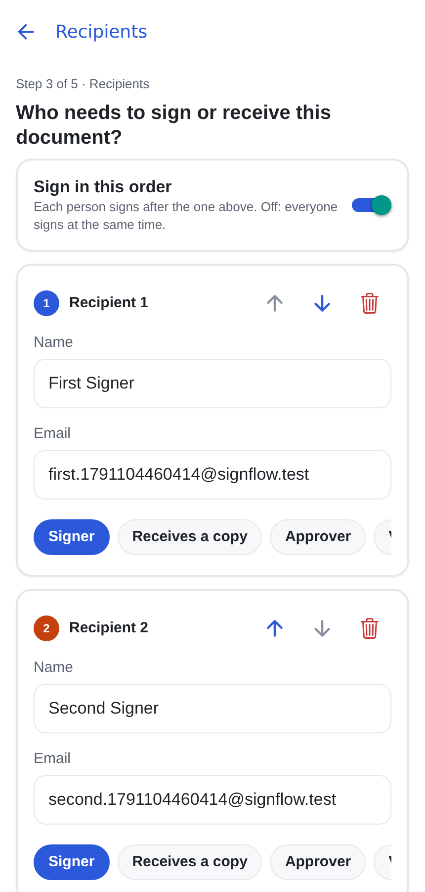
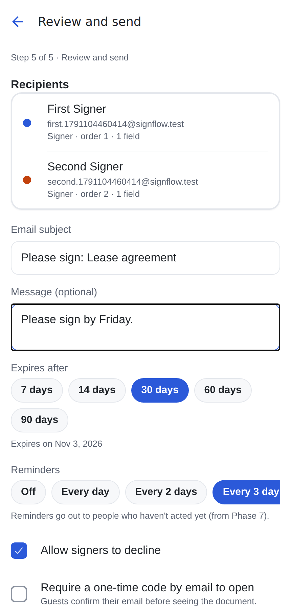
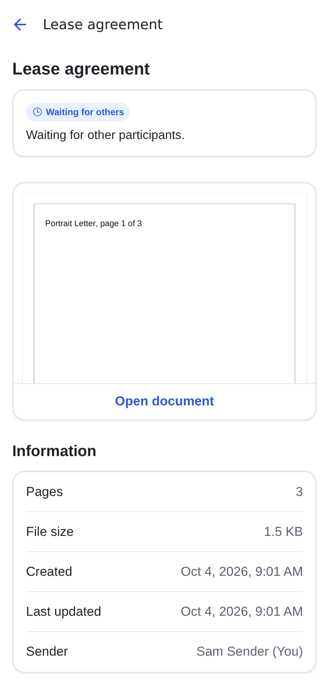

# Phase 5 report: recipients & send

## 1. Summary

- **Recipients step** (wizard step 3, also reachable from a draft's details screen):
  - one row per person, with name, email and role (Signer, Receives a copy, and the SHOULD roles
    Approver and Viewer);
  - a "Sign in this order" switch, accessible up/down reordering and "Add me";
  - validation: name required, email valid and unique ignoring case;
  - placeholder recipients created in the editor are filled in here;
  - removing a recipient who has fields asks for confirmation.
- **Review & send** (step 5, reached from the editor's Next):
  - a recipient summary with each person's role, order and field count;
  - email subject (default "Please sign: {title}") and message;
  - expiry of 7/14/30/60/90 days, defaulting to the profile's setting;
  - reminders (off, or every 1/2/3/7 days, defaulting to the profile), stored for Phase 7;
  - "Allow signers to decline" (on by default) and "Require a one-time code" (stored; enforced by guest
    signing in Phase 6);
  - a list of everything blocking Send, with links to fix it;
  - Save draft and Send.
- **`send-document` Edge Function:**
  - checks the draft against the shared rules (`shared/send.ts`);
  - calls `send_document()`, which locks the row, re-checks the rules, sets `in_progress` and
    activates group 1, all in one transaction;
  - links recipients who already have an account;
  - gives each activated recipient a new 256-bit token (only its SHA-256 is stored);
  - emails a signature request (accessible HTML plus text, personal link `/s/<token>`, expiry date);
  - logs `DOCUMENT_SENT` and one `RECIPIENT_NOTIFIED` per email.
- **Email** goes through an `EmailProvider` interface: Resend in production, Mailpit's HTTP API
  locally. Local dev and tests therefore send real emails, and the tests read them back.
- **Locked after sending.** Fields, recipients and the title can no longer be edited; the database
  enforces this, and the editor shows a read-only notice.

## 2. Decisions (taken without a stop point, as you asked)

1. **CC in sequential order** shares the previous group number. CCs never block a group and are
   notified at completion (Phase 6).
2. **No drag handles in the recipients step.** Up/down buttons are the reordering control (they are
   also the accessible path SPEC §16 requires). Drag: Phase 8 polish.
3. **Email failures don't undo a send.** The document stays sent and the failed recipient IDs are
   returned. Each email failure is logged in the function log, and the missing `RECIPIENT_NOTIFIED` event
   is visible in the audit log. Remind (Phase 7) re-sends.
4. **Linking at send time:** recipients with a verified account get in-app access immediately, instead
   of at their next sign-in.
5. **Shared validation between the app and Deno.** The rules live in one TypeScript module imported by
   both, which needs `allowImportingTsExtensions` (`.ts` import paths) and a root `deno.json` import map
   for `zod`.

## 3. Files

```
supabase/migrations/20261006000100_send.sql        recipient_access_tokens, send_document()
supabase/tests/database/08_send.test.sql           service-role only, re-checks
supabase/functions/send-document/                  index.ts, logic.ts, deno.json
supabase/functions/_shared/email/                  provider.ts (Resend / Mailpit), templates.ts
supabase/functions/_shared/tokens.ts               token generation, hashing, issue/revoke, signing link
supabase/functions/_shared/events.ts               full event type list
supabase/functions/tests/send-document.test.ts     6 tests incl. the done-when criterion, against Mailpit
shared/send.ts (+ test)                            validateForSend, firstActiveOrder
src/features/recipients/                           RecipientsStepScreen, logic.ts, api.ts (+ 2 test files)
src/features/send/                                 ReviewScreen, api.ts (+ test)
app/(app)/documents/new/recipients.tsx, app/(app)/documents/[id]/review.tsx
src/features/editor/FieldEditorScreen.tsx          Next → Review (passes the saved fields along)
src/features/documents/DocumentDetailsScreen.tsx   Review and send / Edit recipients / Place fields
tests/e2e/send-flow.mjs                            the full flow in the web app
deno.json, tsconfig.json                           shared-module imports for Deno
supabase/functions/.env.example                    MAILPIT_API_URL, PUBLIC_SIGNING_URL
```

## 4. Test results

| Check                                 | Result                                                                                                                                                                                                                                                  |
| ------------------------------------- | ------------------------------------------------------------------------------------------------------------------------------------------------------------------------------------------------------------------------------------------------------- |
| `tsc`, `expo lint`                    | clean                                                                                                                                                                                                                                                   |
| Jest                                  | **318 passed** (37 suites)                                                                                                                                                                                                                              |
| pgTAP                                 | **145 passed** (8 files) after `db reset`                                                                                                                                                                                                               |
| Deno                                  | **46 passed**, incl. `send-document` (6) reading the emails from Mailpit                                                                                                                                                                                |
| Integration                           | **16 passed**                                                                                                                                                                                                                                           |
| `node tests/e2e/send-flow.mjs`        | ✓ In the web app, through `functions:serve`: two sequential signers, one signature each. Only the first is emailed (subject, message and token link checked in Mailpit). Recipient statuses are `sent` / `pending`, and the editor is locked afterwards |
| `node tests/e2e/editor-roundtrip.mjs` | ✓ (Phase 4, still passing)                                                                                                                                                                                                                              |

## 5. Done-when criterion

> Sending to 2 sequential signers emails only the first; the draft is locked after sending.

✅ Checked twice: by a Deno test against the function logic, and by the web end-to-end run through
the served Edge Function. Both read the real emails from Mailpit.

| Recipients                      | Review                      | After sending                     |
| ------------------------------- | --------------------------- | --------------------------------- |
|  |  |  |

## 6. Bug found and fixed

The review screen could show "needs a signature field" right after the editor saved. It was reading a
cached, older field list. The editor now hands the saved set to the shared query, and the review screen
always refetches when it opens.

## 7. Known limitations and TODOs

- **"Sent" confirmation on web.** It uses `Alert`, which React Native Web does not display. The details
  screen shows the new status instead. A toast arrives in Phase 7.
- **The signing link (`/s/<token>`) has no page yet.** The guest signing page is Phase 6.
- **Not yet built:** reminders and expiry (`cron-tick`) are Phase 7; push notifications for linked
  accounts are Phase 7.
