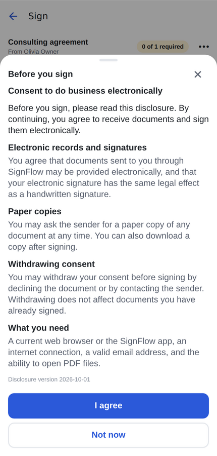
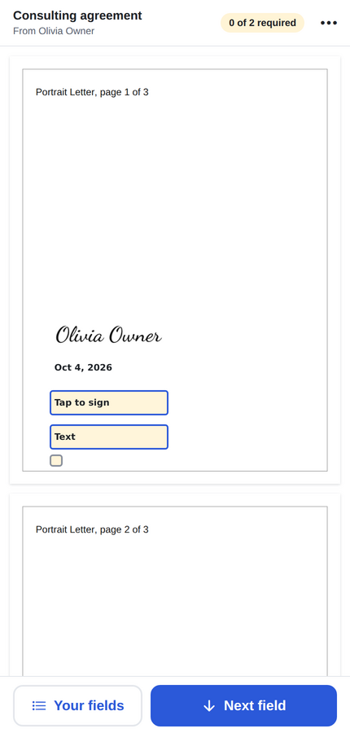
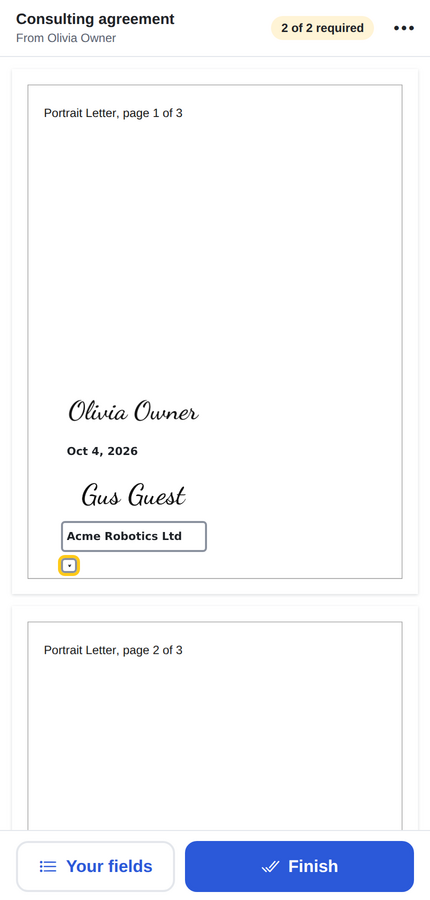
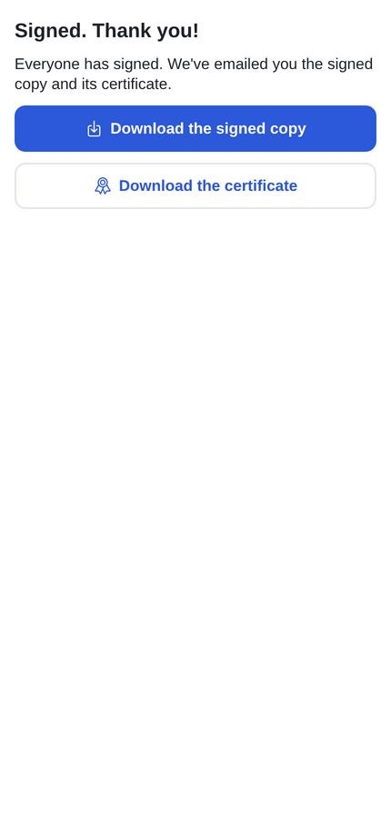
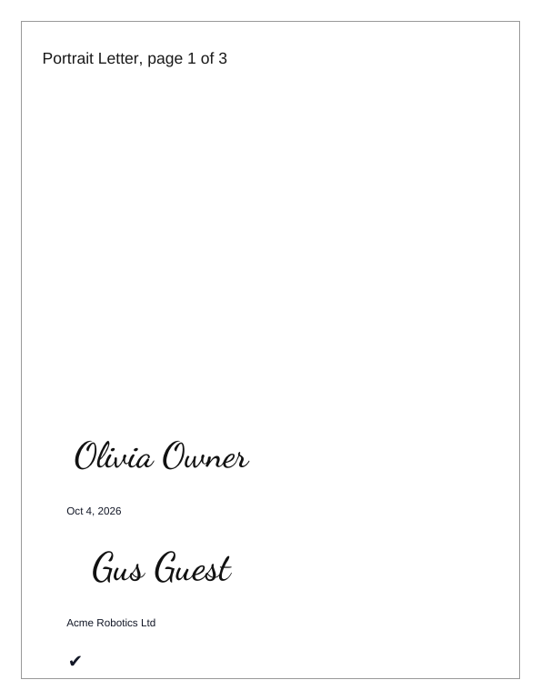
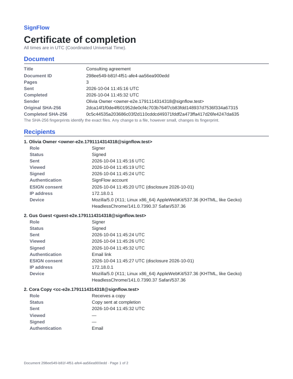

# Phase 6 report: signing & completion

## 1. Summary

- **In-app signing** (`documents/[id]/sign`, "Sign now" / "Review and approve" on the details screen
  when it's your turn):
  - the PDF with your fields highlighted, and earlier signers' values shown as values;
  - a progress pill ("1 of 4 required") and **Next field**, which scrolls to the next required field
    and opens it;
  - a **Your fields** list, the accessible way to reach every field without tapping the page;
  - tapping a field opens the right input:
    - signature and initials open the signature sheet, and the adopted image fills your other fields
      of that kind with one tap each;
    - checkboxes and radios toggle in place;
    - name and email are prefilled, then confirmed;
    - the date is filled in automatically;
  - ⋯ menu: Decline (with a required reason, if the sender allows it), Download original, View details.
- **ESIGN consent:** the versioned disclosure (`shared/legal.ts`) appears before the first
  interaction. It is recorded in `esign_consents` and logged as `ESIGN_CONSENT_ACCEPTED`.
- **Finish:** an explicit confirmation ("…the legal equivalent of your handwritten signature…") records
  intent to sign. Approvers get **Approve** instead, and viewers a read-only view.
- **Guest signing** at `/s/<token>`, the same screens served by the web export. Guests never have a
  Supabase session; every call goes through a guest Edge Function that re-validates the token.
  - Pages for every link state: invalid link, expired link, replaced link, not your turn (with who it's
    waiting for), already signed, completed, declined, voided, expired.
  - **Email code:** when the sender required it, the guest sees only a masked email until they enter
    the emailed 6-digit code (hashed, 10 minutes, 5 tries, rate-limited).
  - After signing: a finished page with **Download the signed copy** and **certificate**, plus
    **Get the SignFlow app** when `EXPO_PUBLIC_APP_DOWNLOAD_URL` is set.
- **Group advancement:** when the last signer or approver of a group finishes, the next group is
  activated and emailed new links. Viewer-only groups never block. Parallel signers in one group wait
  for each other.
- **Completion (`finalize-document`):**
  - flattens every value into a copy of the original: signature images, text upright on rotated
    pages, ✔ for checkboxes, ● for radio choices;
  - builds a **certificate of completion** with the document ID, both SHA-256 hashes, the sender, and
    for each recipient their role, timestamps, IP, device, authentication method and consent version,
    followed by the full event history in UTC;
  - stores both files and marks the document completed;
  - emails **everyone, CCs included**, with both PDFs attached and a link. Guests get a 30-day
    download-only link.
- **Decline:** the document becomes declined and all links stop working. The owner and the other active
  recipients are emailed the reason.

## 2. Decisions (taken without a stop point)

1. **One transaction per state change, behind a row lock.** The values, recipient status and group
   advance are written by `complete_recipient()`; `decline_recipient()` and `mark_document_completed()`
   work the same way. Each locks the document row, so two parallel signers can't both "finalize" and
   nobody can sign out of turn. Signature images are uploaded first and removed if the transaction
   refuses the submission.
2. **Finalization runs inside the last signer's request.** If it fails (storage or email outage),
   that signer's submission still counts: the document stays `in_progress` with everyone signed, and
   the owner can retry with `finalize-document`. Phase 7's cron can also retry automatically.
3. **The certificate is a separate PDF, not extra pages.** SPEC §12.2's SHOULD of appending it is
   deferred, because the completed SHA-256 must be the hash of the signed document itself. SPEC is
   updated.
4. **Completion links for guests:** signing links are revoked at completion (SPEC §7), so the
   completion email carries a new `purpose = 'download'` token. It downloads the signed copy and
   certificate only, for 30 days. The files are also attached when they total 15 MB or less.
5. **Dates use the signer's time zone.** The app sends the device's IANA zone, the server formats the
   date itself, and an invalid zone falls back to UTC. The client never supplies the date value.
6. **Other signers' signatures are sent to the screen as data URLs.** The PDF surface's sandbox only
   loads `data:` images, so no extra storage URLs are exposed.
7. **Fonts:** flattening uses the PDF standard fonts (WinAnsi). Characters outside that set (for example
   CJK) print as "?". Embedding a Unicode font is a Phase 8 item, alongside the CJK viewer fonts already
   noted in Phase 3.
8. **Guest signatures are never saved.** The signature sheet has a guest mode with no saved list and no
   "Save for future use".

## 3. Files

```
supabase/migrations/20261007000100_signing.sql    field_values, recipient_otps, esign_consents, token purpose/OTP flag,
                                                  complete/decline/mark_completed/activate_next_group, PNG in documents bucket
supabase/tests/database/09_signing.test.sql       27 assertions (turns, values, visibility, decline, completion)
shared/signing.ts (+ test)                        value rules, progress, next field, date format, session types
shared/legal.ts                                   ESIGN disclosure (versioned)
supabase/functions/_shared/signing.ts             signer resolution (session / token), session, consent, submit, decline, guest download
supabase/functions/_shared/finalize.ts            flatten + certificate + store + complete + completion emails
supabase/functions/_shared/pdf/certificate.ts     certificate PDF
supabase/functions/_shared/pdf/stamp.ts           + stampText / textPlacement (upright on rotated pages)
supabase/functions/_shared/otp.ts, serveGuest.ts, notify.ts, signingHandlers.ts
supabase/functions/{signing-session,esign-consent,submit-signing,decline,finalize-document,
                    guest-open,guest-consent,guest-submit,guest-decline,guest-download,guest-otp}/
supabase/functions/tests/signing.test.ts          7 tests incl. the done-when criterion
supabase/functions/tests/stamp-text.test.ts       text placement on 0/90/180/270 pages, WinAnsi fallback
src/features/signing/                             SigningFlow, SigningScreen, sheets, logic, api (+ 2 test files)
app/(guest)/s/[token].tsx, app/(app)/documents/[id]/sign.tsx
src/features/documents/DocumentDetailsScreen.tsx  Sign now / Review and approve; signed copy + certificate downloads
src/features/signatures/SignatureSheet.tsx        guest mode; returns PNG bytes
app.config.ts                                     universal links / App Links (SIGNFLOW_SIGNING_DOMAIN)
tests/e2e/signing-flow.mjs                        the done-when criterion in the web app
```

## 4. Test results

| Check                                 | Result                                                                                                                                                             |
| ------------------------------------- | ------------------------------------------------------------------------------------------------------------------------------------------------------------------ |
| `tsc`, `expo lint`                    | clean                                                                                                                                                              |
| Jest                                  | **343 passed** (40 suites), incl. signing flow (consent → sign → finish, decline, OTP, link errors, status pages) and logic                                        |
| pgTAP                                 | **172 passed** (9 files) after `db reset`                                                                                                                          |
| Deno                                  | **59 passed**, incl. signing (7, against Mailpit and Storage) and text placement (6)                                                                               |
| Integration                           | **16 passed**                                                                                                                                                      |
| `node tests/e2e/signing-flow.mjs`     | ✓ owner signs in the app, guest by link, CC copied. 3 completion emails with both PDFs, each attachment's hash checked against the stored file and the certificate |
| `node tests/e2e/send-flow.mjs`        | ✓ (Phase 5, still passing)                                                                                                                                         |
| `node tests/e2e/editor-roundtrip.mjs` | ✓ (Phase 4, still passing)                                                                                                                                         |

## 5. Done-when criterion

> Owner + 1 guest + 1 CC complete a document; everyone receives the flattened PDF + certificate; the
> hashes on the certificate match the files.

✅ Checked twice, in a Deno test and in the web end-to-end run.

- **Completion emails:** the owner, the guest and the CC each receive one, with two attachments.
- **Hashes:**
  - the attached signed PDF's SHA-256 equals the stored file's and the one printed on the certificate;
  - the certificate's original hash equals the uploaded fixture's;
  - the attached certificate equals the stored one.
- **Flattened values** sit where they were on screen, including on a `/Rotate 90` page.

| Consent                      | Guest, before signing            | Guest, filled                     | Finished                            |
| ---------------------------- | -------------------------------- | --------------------------------- | ----------------------------------- |
|  |  |  |  |

| Flattened PDF              | Certificate                  |
| -------------------------- | ---------------------------- |
|  |  |

## 6. Known limitations and TODOs

- **Not checked on devices.** Taps go through the WebView surface the same way as the editor's, and the
  signature sheet is the Phase 3 one. Both are tested in Chromium only, not on iOS or Android.
- **SPEC §19's Maestro E2E** (upload → send → sign → completed on device builds) is not written yet. The
  same flow runs on web with Playwright (`tests/e2e/signing-flow.mjs`). Maestro needs device builds:
  Phase 8.
- **Universal links** need the host files (`apple-app-site-association`, `assetlinks.json`), which need
  the Apple team ID and the release signing key. The README describes them.
- **Checkmarks in tiny boxes** render small in the on-screen preview. The flattened PDF is correct.
- **Not yet built:**
  - void, remind, reminders and expiry (cron), and the automatic finalize retry: Phase 7;
  - push and in-app notifications for "signed" or "declined": Phase 7;
  - the SHOULD hash chain on events: Phase 8;
  - editing an un-acted recipient's email after sending (SHOULD): Phase 7, with Remind.
