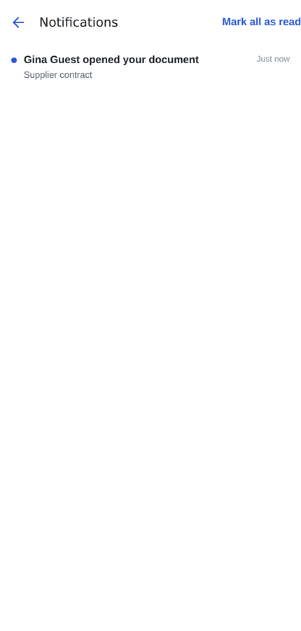
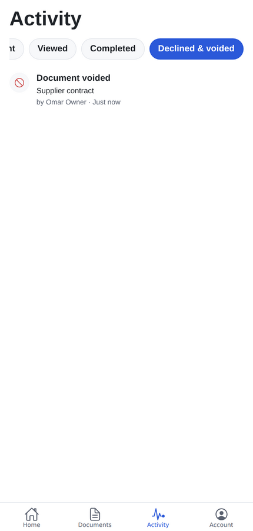
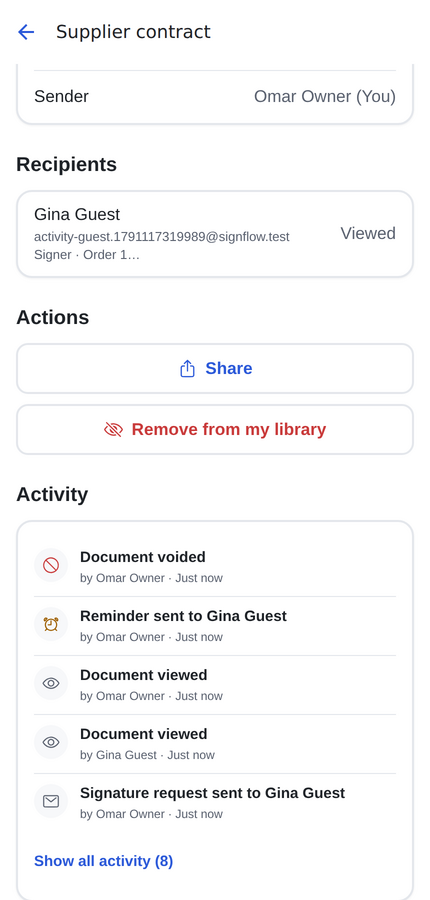
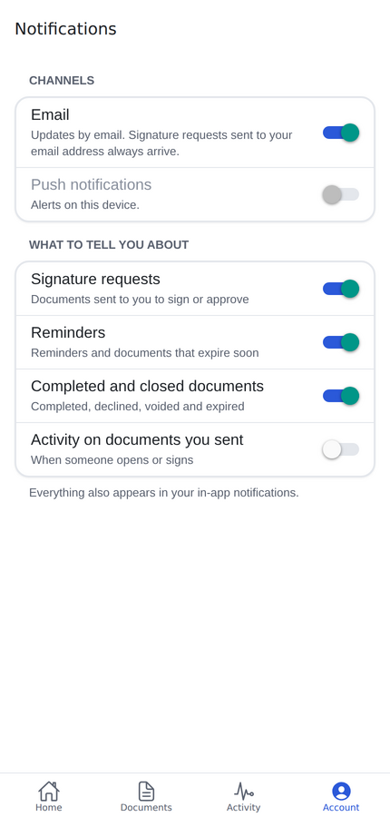

# Phase 7 report: activity, notifications, reminders

## 1. Summary

- **Activity tab:** every event across your documents, newest first, with an icon, description, actor,
  document and time.
  - Filters: All, Signed, Sent, Viewed, Completed, Declined & voided.
  - Pull to refresh, infinite scroll; tapping a row opens the document.
- **Document details:**
  - **Activity timeline:** the latest five events, with "Show all".
  - **Remind:** tap a waiting recipient for "Remind {name}", or use "Remind everyone".
  - **Void:** requires a reason, which is then shown on the status banner.
- **In-app inbox:** a bell with an unread dot on Home. The inbox shows newest first, with unread
  markers and "Mark all as read". Opening a notice marks it read and opens its document.
- **Notices.** Each event goes to the inbox, and to push and email where your preferences allow.
  - Signature request and reminder.
  - "Expires tomorrow".
  - Someone opened or signed your document.
  - Declined, completed, voided, expired.
- **Push** through Expo push tokens (`expo-notifications`):
  - the device registers through `register-push-token`;
  - tapping a push opens the document;
  - signing out removes the device's token;
  - tokens that Expo reports as `DeviceNotRegistered` are deleted.
- **Account → Notifications:** email and push switches, plus four topics: signature requests,
  reminders, completed/closed documents, and activity on documents you sent.
- **Account → Default signing settings:** default expiry and reminder interval. The Phase 5 list had
  this item but it was never built; the Review step already uses these defaults.
- **Reminders and expiry from cron.** `pg_cron` runs `cron-tick` every 15 minutes, through `pg_net`, with a
  shared secret kept in Vault. Each run:
  1. expires overdue documents, revokes their links, and notifies the owner;
  2. sends "expires tomorrow" to whoever still has to act;
  3. sends due reminders (`now ≥ coalesce(last_reminded_at, sent_at) + interval`) with a new link;
  4. retries finalizations that failed after the last signature (Phase 6's open item);
  5. deletes `uploads-tmp` images older than 24 hours.

## 2. Decisions (taken without a stop point)

1. **Claims are atomic.** Each cron step is a single `UPDATE … RETURNING` (reminders also use
   `FOR UPDATE SKIP LOCKED`). Overlapping or retried ticks therefore never send twice, and manual
   Remind and cron share the same `last_reminded_at`.
2. **A reminder issues a new link.** Older links stop working (SPEC §7), so a forwarded old email can't
   be used.
3. **The in-app inbox always records; preferences gate email and push.** Some emails always go out:
   requests, reminders and completions to people signing by link (they have no other channel), and
   void notices to recipients.
4. **Topics:**
   - "requests" covers signature requests;
   - "reminders" covers reminders and "expires tomorrow";
   - "completed" covers completed, declined, voided and expired;
   - "activity" covers viewed and signed.

   The owner's "X signed" email is under activity, on by default.

5. **Push needs an EAS project ID** (`EAS_PROJECT_ID` at build time). Without it the push switch is
   disabled and everything else works. The app asks for push permission only when the user turns push on
   in settings, never at launch. A grant given earlier is refreshed silently.
6. **The cron target lives in Vault, never in a migration**, so each environment sets its own URL and
   secret. Locally, `seed.sql` creates them, and `cron-tick` has `verify_jwt = false` and checks the
   secret in constant time.
7. **"Edit an un-acted recipient's email after sending"** (a SHOULD) is not done; Remind covers the
   common case. Deferred: Phase 8 or later.

## 3. Files

```
supabase/migrations/20261008000100_activity_notifications.sql   notifications, push_tokens, list_activity, void_document,
                                                               claim_manual_reminder, claim_due_reminders, expire_due_documents,
                                                               claim_expiry_warnings, stalled_finalizations, stale_tmp_uploads,
                                                               run_cron_tick + pg_cron job; documents.expiry_warned_at
supabase/tests/database/10_activity_notifications.test.sql     31 assertions
supabase/seed.sql, supabase/config.toml                        local Vault secrets; cron-tick without JWT check
shared/notifications.ts (+ test)                               preferences schema, topics, notice types
supabase/functions/_shared/notifications.ts                    deliver(): inbox + push (Expo) + email by preference
supabase/functions/_shared/lifecycle.ts                        remind, void, register push token, cron-tick sweep
supabase/functions/_shared/notify.ts, signing.ts, finalize.ts  notices for request/reminder/viewed/signed/declined/completed
supabase/functions/{remind,void-document,register-push-token,cron-tick}/
supabase/functions/tests/lifecycle.test.ts                      5 tests incl. the done-when criterion through pg_cron
src/features/activity/                                         ActivityScreen, ActivityRow, DocumentTimeline, api, hooks
src/features/notifications/                                    InboxScreen, api, hooks, push(.web).ts, deviceToken
src/features/account/{NotificationPrefsScreen,DefaultSigningScreen}.tsx
src/features/documents/                                        Remind / Void on details, VoidSheet
src/components/SwitchRow.tsx
.github/workflows/ci.yml                                       serves the functions so the cron test runs in CI
tests/e2e/activity-flow.mjs
```

## 4. Test results

| Check                              | Result                                                                                                                                             |
| ---------------------------------- | -------------------------------------------------------------------------------------------------------------------------------------------------- |
| `tsc`, `expo lint`                 | clean                                                                                                                                              |
| Jest                               | **355 passed** (45 suites), incl. Activity, inbox, notification settings, default signing, Remind/Void/timeline on details                         |
| pgTAP                              | **203 passed** (10 files)                                                                                                                          |
| Deno                               | **64 passed**, incl. lifecycle (5)                                                                                                                 |
| Integration                        | **16 passed**                                                                                                                                      |
| `node tests/e2e/activity-flow.mjs` | ✓ guest opens → owner's inbox notice and bell dot → remind (new link) → void with reason (link closed) → timeline, Activity filter, settings saved |
| `node tests/e2e/signing-flow.mjs`  | ✓ (Phase 6, still passing)                                                                                                                         |

## 5. Done-when criterion

> Reminders and expiry fire from cron in local dev (time-travel test); push arrives on a device build.

- **Cron: ✅** The Deno test moves a recipient's `sent_at` three days back and a document's
  `expires_at` an hour back. It then runs exactly the command the scheduled job runs,
  `select public.run_cron_tick()`. pg_net POSTs to `cron-tick` in the local functions runtime, whose log
  shows `{"expired":1,"reminders":1}`. The test then checks:
  - the reminder email with a new link, after which the old link is refused;
  - the expired document and its link showing "expired";
  - the owner's expiry email and inbox notice;
  - the `REMINDER_SENT` (automatic) and `DOCUMENT_EXPIRED` events;
  - a second tick sending nothing.

  pgTAP checks the job is scheduled `*/15 * * * *`.

- **Push on a device build: ⏳ not verifiable here.** No device or EAS project is available in this
  environment. What is verified:
  - the server sends the right Expo messages (to an in-process stand-in for Expo's push service):
    the signature request carries `documentId`, it is skipped when push is off, and dead tokens are
    removed;
  - the client code type-checks against `expo-notifications` 57.

  To finish it, build with `EAS_PROJECT_ID`, turn on push in Account → Notifications, and send yourself
  a document.

| Inbox                      | Activity                      | Details after void                  | Notification settings                   |
| -------------------------- | ----------------------------- | ----------------------------------- | --------------------------------------- |
|  |  |  |  |

## 6. Known limitations and TODOs

- **Push on a device** is unverified (see §5). Android also needs FCM credentials in EAS.
- **No realtime:** the unread count refreshes every minute, on focus, and when a push arrives.
  Supabase Realtime could come later.
- **Times are in the device's locale and zone,** relative ("5m ago") for the last week.
- **Not built:**
  - editing an un-acted recipient's email after sending (a SHOULD);
  - Activity export (LATER).
