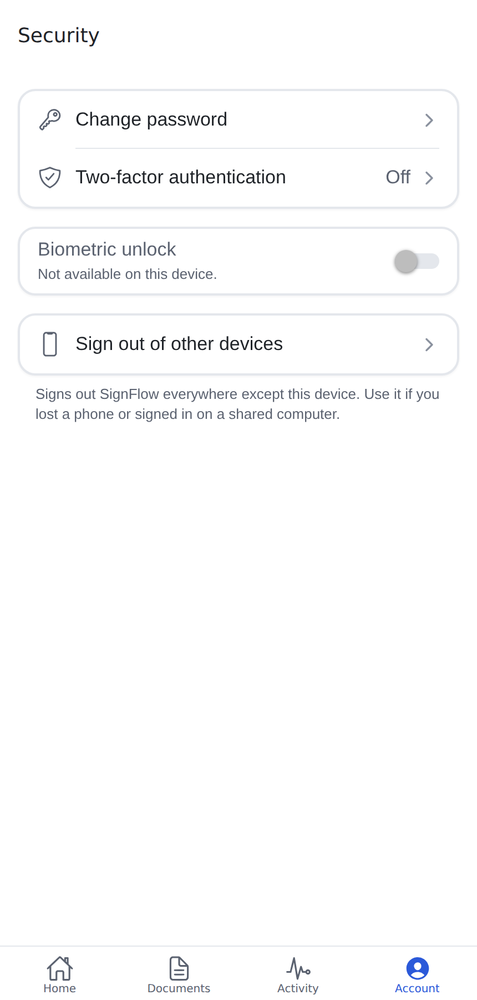
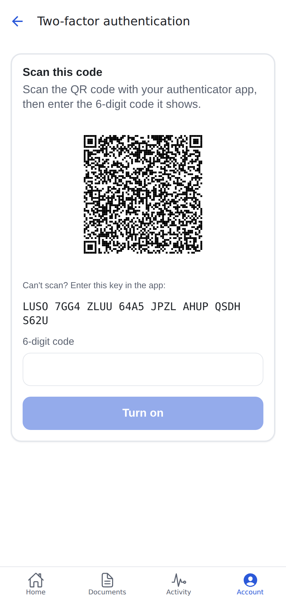
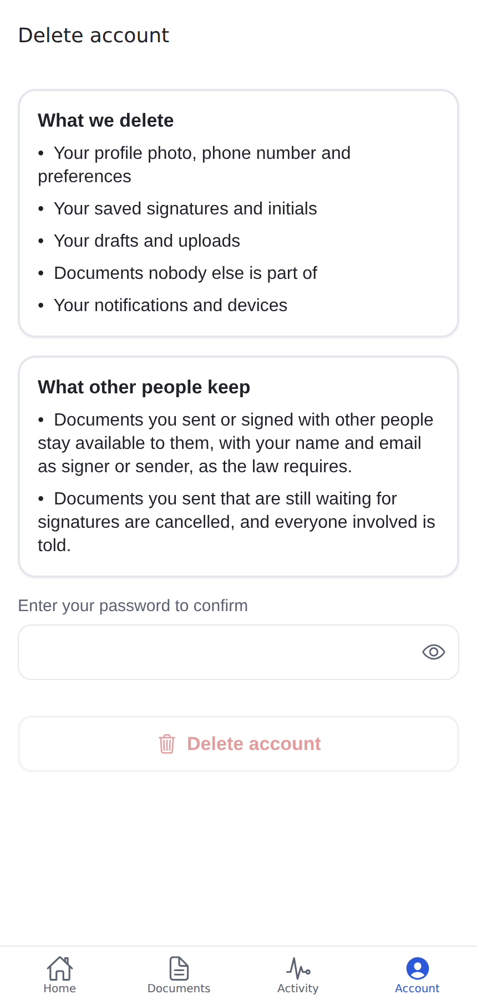

# Phase 8 report: hardening and release

## 1. Summary

### Account → Security

A new screen:

- **Change password:** asks for an emailed code when the last sign-in is not recent.
- **Two-factor authentication (TOTP):**
  - setup shows a QR code, the key, and an "Open authenticator app" link;
  - it is turned on with a 6-digit code and can be turned off.
- **Biometric unlock:**
  - Face ID, Touch ID or fingerprint, with the device passcode as fallback;
  - it asks at launch and after 60 s in the background, and is turned off at sign-out.
- **Sign out of other devices.**

### Two-factor at sign-in

After the password or a social sign-in, the app asks for the authenticator code. The server enforces
it, not only the app:

- a restrictive RLS policy on every table and on `storage.objects`;
- a check in the definer helpers;
- `MFA_REQUIRED` from every Edge Function for `aal1` sessions of users who have a factor.

### Account → Delete account (SPEC §17.3)

- Explains what is deleted and what other people keep.
- **Re-authentication:** the password, or for social-only accounts a fresh Apple/Google sign-in.
- **Server side** (`delete-account`):
  - voids the user's documents in progress, and their recipients are told;
  - removes their own data and files;
  - turns the profile into a name-and-email tombstone;
  - soft-deletes the auth user, which signs them out everywhere.

### Security review

`docs/security-checklist.md` covers SPEC §14 item by item, with the evidence for each.

- **Rate limits:** five endpoints that had none now do. Every signed-in caller also has an overall
  limit of 300 calls a minute.
- **Server error log:** now keeps only name, message and stack, never whole error objects.
- **Dependency audit in CI:** `npm run audit:deps` checks against an allowlist that needs a reason
  and a review-by date per entry.
- **Function config check:** `npm run check:functions` (see §4).

### Crash reporting (Sentry)

- Off unless a DSN is set.
- Events are scrubbed on the device: emails, tokens, signing links, signed-URL tokens, phone numbers
  and inline images are removed, and the user is reduced to its id.
- No screenshots, view hierarchy or console breadcrumbs.

### Accessibility audit

- axe-core (WCAG 2.1 AA) plus a 44 pt touch-target check on 17 screens of the web build.
- The first run found 11 violations. All are fixed, and the script now fails CI-style on serious or
  critical issues.
- A manual checklist for VoiceOver, TalkBack and Dynamic Type is in `docs/accessibility-audit.md`.

### Performance on 200 pages

- The whole signing path on a 200-page, 22 MB document was measured, and the viewer benchmark was
  re-run (§5).

### Release material

- `docs/release/store-listing.md`: copy, assets and review notes.
- `docs/release/privacy-labels.md`: App Store and Play answers.
- Draft store screenshots, plus a script to regenerate them.

### Native E2E

- Maestro flows for iOS and Android builds in `e2e/maestro`: sign a request through the field list,
  security, and delete account, with a seed script.

## 2. Decisions (taken without a stop point)

1. **Deletion keeps a tombstone, not nothing.** Documents and the append-only audit log reference
   the profile, so the row stays, keeping only the name and email that others' records show.
   - Supabase's soft delete removes the login, and the same email can register again as a new account.
   - Documents nobody else takes part in are deleted outright.
2. **Social-only accounts re-authenticate by signing in again.** The server accepts a JWT whose
   latest `amr` timestamp is less than 10 minutes old, because there is no password to ask for.
3. **Two-factor is enforced in the database.** A client-only check would let anyone with the
   password reach the API directly.
   - This uses one helper, `mfa_satisfied()`, and one restrictive policy per table.
   - Users who never turn on 2FA see no difference.
4. **Biometric unlock locks the UI, not the session.** This is the usual app behaviour: the session
   stays usable by the system so background refresh and push keep working. It is opt-in, per device,
   and turned off at sign-out.
5. **Password change uses Supabase's "secure password change".** It asks for an emailed code when the
   sign-in is not recent, instead of asking for the current password, which Supabase only supports
   behind a server flag.
6. **Dependency audit uses an allowlist.** Today's two high advisories are in the Expo CLI's build
   tooling (`braces`, `node-forge`), not in the app or functions.
   - A blanket "fail on high" would be red from day one, and "critical only" would be blind.
   - The allowlist expires on 2027-01-31.
7. **Readable text never uses `textTertiary`.** It is 3.2:1 on white and is now reserved for
   disabled and decorative elements (SPEC §3.1 note). The token itself is unchanged.

## 3. Files

```
supabase/migrations/20261009000100_account_deletion.sql  profiles.deleted_at, delete_account_data(), email trigger keeps the tombstone email
supabase/migrations/20261009000200_mfa.sql               mfa_satisfied(), restrictive policies (11 tables + storage), definer checks
supabase/tests/database/11_account_deletion.test.sql     14 assertions
supabase/tests/database/12_mfa.test.sql                  9 assertions
supabase/functions/delete-account/                       re-auth, void in-progress, data + files, soft-delete auth user
supabase/functions/_shared/context.ts                    aal + authenticatedAt from the JWT; MFA_REQUIRED for aal1 with a factor
supabase/functions/_shared/serve.ts                      overall 300/min per user
supabase/functions/_shared/{lifecycle,signingHandlers}.ts, delete-draft/logic.ts   new per-action limits
supabase/functions/_shared/http.ts                       error log without whole objects
supabase/functions/*/deno.json                           every function maps zod (delete-account failed to boot without it)
supabase/functions/tests/{delete-account,mfa,signing-performance}.test.ts
supabase/config.toml                                     TOTP enroll/verify, secure_password_change
shared/errors.ts                                         REAUTH_REQUIRED, MFA_REQUIRED
src/features/auth/{mfa,session}.ts, screens/TwoFactorChallengeScreen.tsx, store.ts ('mfaRequired')
app/_layout.tsx, app/index.tsx, app/(auth)/{_layout,two-factor}.tsx   route guards for the code challenge
src/features/security/                                   Security, ChangePassword, TwoFactorSetup, DeleteAccount, AppLockGate, appLock, api (+ tests)
app/(app)/(tabs)/account/{security,change-password,two-factor,delete}.tsx
src/lib/{monitoring,scrub}.ts (+ test)                   Sentry init, PII scrubbing
src/components/{ChipGroup,SwitchRow,TextLink,SearchField,BottomSheet}.tsx and screens   accessibility fixes
scripts/{audit-deps,check-functions,store-screenshots}.mjs, scripts/e2e/seed-native.mjs, security/audit-allowlist.json
tests/e2e/{security-flow,a11y-audit}.mjs
e2e/maestro/                                             _sign-in, sign-document, security, delete-account, config
docs/security-checklist.md, docs/accessibility-audit.md, docs/release/{store-listing,privacy-labels}.md, docs/release/screenshots/
```

New dependencies (through `expo install`):

- `expo-local-authentication`, with its plugin and the Face ID string;
- `expo-image`, to render the QR code SVG on native;
- `@sentry/react-native`, whose plugin is added only when `SENTRY_ORG` and `SENTRY_PROJECT` are set;
- `axe-core` (dev).

## 4. Test results

| Check                                                  | Result                                                                                                         |
| ------------------------------------------------------ | -------------------------------------------------------------------------------------------------------------- |
| `tsc`, `expo lint`, Prettier (touched files)           | clean                                                                                                          |
| Jest                                                   | **374 passed** (49 suites), incl. security screens, 2FA challenge, app lock, session/MFA store, scrubber       |
| pgTAP                                                  | **226 passed** (12 files)                                                                                      |
| Deno                                                   | **68 passed**, incl. delete-account (2), MFA (1), 200-page signing timing (1)                                  |
| Integration                                            | **16 passed**                                                                                                  |
| `npm run audit:deps`, `check:functions`                | ok (2 accepted advisories, see §2.6)                                                                           |
| `node tests/e2e/security-flow.mjs`                     | ✓ 2FA on → other devices signed out → code challenge (wrong code refused) → password changed → account deleted |
| `node tests/e2e/a11y-audit.mjs`                        | ✓ 0 violations on 17 screens (first run: 11 violations on 7 screens, all fixed)                                |
| `node tests/e2e/activity-flow.mjs`, `signing-flow.mjs` | ✓ (still passing)                                                                                              |
| Maestro (`e2e/maestro`)                                | ⏳ **not run**: needs iOS/Android builds and a simulator or device                                             |

E2E found a real bug that unit tests could not: `delete-account` had no `deno.json`, so it failed to
boot ("Relative import path "zod" not prefixed"). The Deno tests use the root `deno.json`, so they
passed. It is now fixed, and `check:functions` in CI stops it recurring.

## 5. Performance (200 pages)

**Signing path.** `signing-performance.test.ts`, local stack, on a 200-page, 22.1 MB document with one
image per page:

| Step                    | Wall   | CPU    | RSS     |
| ----------------------- | ------ | ------ | ------- |
| upload                  | 480 ms | 92 ms  | +44 MB  |
| process-upload          | 584 ms | 364 ms | +61 MB  |
| send-document           | 110 ms | 35 ms  | +1 MB   |
| guest-open              | 124 ms | 29 ms  | +0 MB   |
| guest-submit + finalize | 1.42 s | 641 ms | +113 MB |

Finalization of 200 pages (stamp, hash, certificate) uses about 0.64 s of CPU. ⏳ Compare with the
hosted Edge Function CPU, memory and wall-clock limits in Supabase's current docs before launch.

**Viewer.** `tests/surface/performance.mjs` in Chromium; device runs are still pending:

| Profile                             | First page | Scroll 200 pages     | Max canvases | Canvas memory |
| ----------------------------------- | ---------- | -------------------- | ------------ | ------------- |
| iPhone-sized 390×844 @3x            | 513 ms     | 12.6 s (63 ms/page)  | 6            | 36 MB         |
| Low-end Android 360×780 @2x, CPU ÷4 | 1.67 s     | 33.8 s (169 ms/page) | 6            | 13 MB         |

## 6. Done-when criterion

> Security checklist signed off; E2E suite green on iOS + Android builds.

- **Security checklist: ⏳ ready for sign-off.**
  - Every code item in `docs/security-checklist.md` is ✅ or ⚠️, and each ⚠️ is an accepted, written-up
    limitation:
    - access tokens stay valid until they expire (≤ 1 h);
    - biometric unlock locks the UI only.
  - The ⏳ items need the owner:
    - hosted Auth settings matching `config.toml`;
    - Vault and function secrets;
    - Sentry server-side scrubbing;
    - a confirmed `X-Forwarded-For` source;
    - legal review;
    - optionally, a penetration test.
  - The sign-off table is at the end of the checklist.
- **E2E on iOS and Android builds: ⏳ not verifiable here.** No simulator, device or EAS project is
  available in this environment. What is in place:
  - the Maestro suite and its seed script;
  - the same flows passing on the web build (security, signing, activity, accessibility).

  To finish:

  ```
  eas build --profile development
  node scripts/e2e/seed-native.mjs
  maestro test -e APP_ID=<bundle id> <printed values> e2e/maestro
  ```

  Run it once on iOS and once on Android.

| Security                      | 2FA setup                             | Sign-in code                              | Delete account                      |
| ----------------------------- | ------------------------------------- | ----------------------------------------- | ----------------------------------- |
|  |  |  |  |

## 7. Known limitations and TODOs

- **Device-only checks:**
  - Maestro on iOS and Android;
  - VoiceOver, TalkBack and Dynamic Type (`docs/accessibility-audit.md`);
  - biometric unlock;
  - push (from Phase 7);
  - Apple and Google sign-in;
  - 200-page viewer on real hardware.
- **Placeholders:**
  - legal URLs (`example.com`), bundle ID, icon and brand (SPEC §22 Q1, Q2, Q7);
  - store screenshots are drafts from the web build.
- **Not built:**
  - a web page for deletion requests, which Google Play requires (`docs/release/privacy-labels.md`);
  - zxcvbn password strength (SHOULD);
  - an active-sessions list (LATER);
  - editing an un-acted recipient's email after sending (a Phase 7 SHOULD).
- **Web header back button** is 30×30 on web only (react-navigation); native uses the system control.
- **Placeholder text** uses `textTertiary`. axe does not check it; consider darkening it after the brand
  colours are final.
